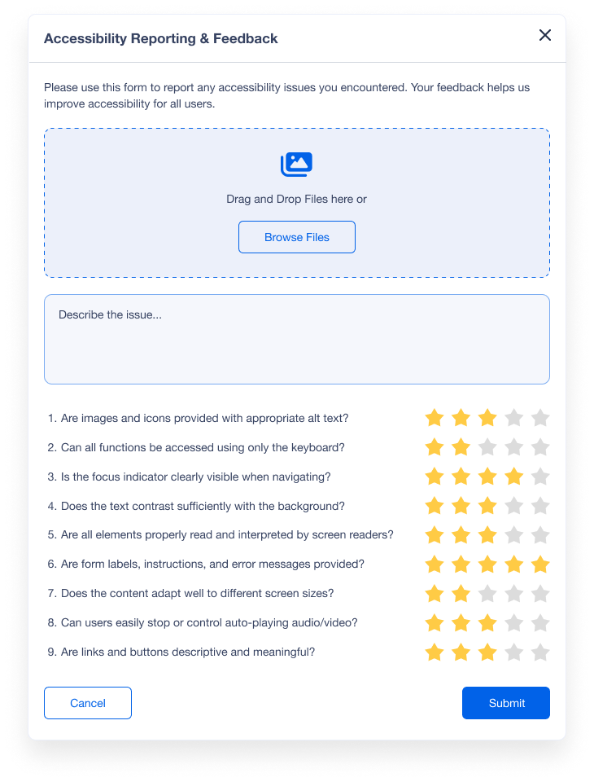

## Figma for UI Design
[Link to Figma for UI](https://www.figma.com/design/ey9eSdwdZQ75f1vrWGBPGs/COMP231_Team2?node-id=0-1&t=mJhy1WpkZAdFv1kr-1)

## Rating interface (rating criteria and scoring system)

### Moderator dashboard - report management

### Moderator dashboard - flagged content

### Identify configurable system-wide preferences
System Settings
- Theme: Light Mode / Dark Mode  
- Default Language: English  
- Password Policy: Minimum 8 characters, Must include a special character, ...
- Notification Settings: Enable Email Notifications / Disable  
- Data Storage: Cloud Storage / Local Storage 

### FE - issue reporting form with uploads - reporter

### FE - report review page - administrator
